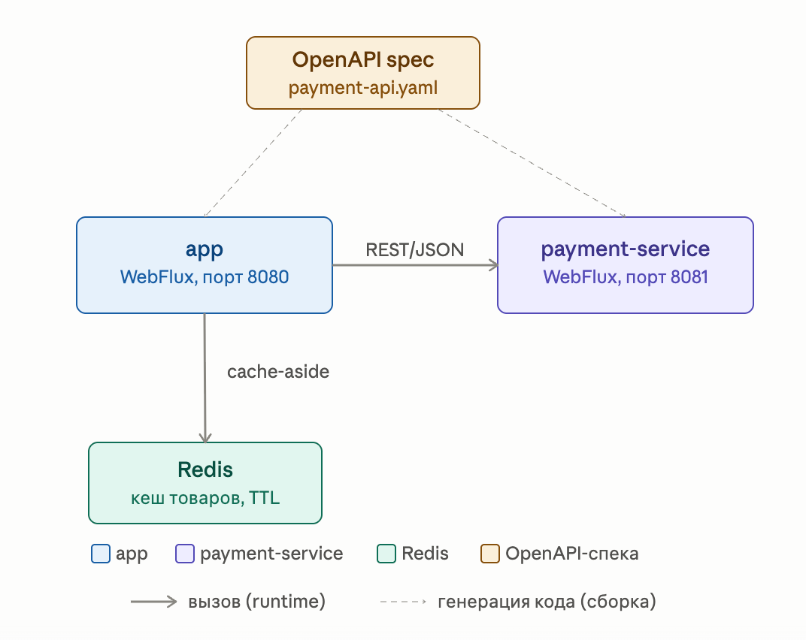

# my-market-app-reactive

Реактивный интернет-магазин спортивных товаров на стеке Spring WebFlux — мультипроект из двух модулей: витрина товаров (`app`) и сервис платежей (`payment-service`), взаимодействующие через REST-контракт, описанный в OpenAPI.

## Стек

| Слой | Технология |
|---|---|
| HTTP-серверы | Spring WebFlux (Netty), оба модуля |
| Шаблоны (`app`) | Thymeleaf |
| БД (`app`) | H2 in-memory (R2DBC) |
| Кеш товаров (`app`) | Redis (Spring Data Redis, аннотационный `@Cacheable`) |
| Баланс (`payment-service`) | in-memory (`AtomicLong`, без БД) |
| Контракт `app` ↔ `payment-service` | OpenAPI 3 + `org.openapi.generator` (реактивный клиент/сервер) |
| Сборка | Gradle 9, Java 21 |

## Модули

| Модуль | Порт | Назначение |
|---|---|---|
| `app` | 8080 | Витрина товаров, корзина, заказы |
| `payment-service` | 8081 | Проверка баланса и списание средств при оформлении заказа |
| `redis` (только в Docker Compose) | 6379 | Кеш товаров для `app` |



## Функциональность

- Витрина товаров с поиском, сортировкой (по алфавиту / по цене) и пагинацией — данные читаются из Redis-кеша, при промахе подгружаются из БД
- Детальная страница товара — также кешируется
- Корзина: добавление, уменьшение количества, удаление товара
- Оформление заказа: перед созданием заказа `app` обращается в `payment-service` за списанием суммы; если баланс недостаточен или сервис недоступен — кнопка «Купить» на странице корзины скрывается и показывается соответствующее сообщение, а `POST /buy` не создаёт заказ, даже если запрошен напрямую
- Просмотр истории заказов

## Кеширование товаров (Redis)

- `ItemService.getItemsPage`/`buildPageDto`/`getItem` помечены `@Cacheable` в трёх отдельных cache-регионах — `items` (список), `page` (метаданные пагинации), `item` (карточка товара) — чтобы не путать данные между методами.
- Ключ кеша списка/страницы включает все параметры, влияющие на результат: `search + sort + pageNumber + pageSize`.
- `RedisSerializerConfig` задаёт JSON-сериализацию (Jackson) и TTL для каждого региона из `spring.cache.redis.time-to-live` (по умолчанию 1 минута).
- Работает через блокирующий `spring-boot-starter-data-redis-reactive`-стек, но по аннотациям — Spring Framework 6.1+ умеет нативно кешировать `Mono`-результаты.

## Контракт `app` ↔ `payment-service` (OpenAPI)

Спецификация — [`openapi/payment-api.yaml`](openapi/payment-api.yaml) в корне репозитория (нейтральное место, оба модуля ссылаются на один и тот же файл). Два эндпоинта:

- `GET /balance` → `{ balance }` — текущий баланс.
- `POST /pay` `{ amount }` → `{ success, balance }` — всегда `200 OK`, даже если средств не хватило (`success: false`) — это штатный бизнес-результат, а не ошибка.

Код генерируется автоматически при сборке (`compileJava` зависит от `openApiGenerate` в обоих модулях — отдельно вызывать не нужно, достаточно `./gradlew build`):

- В `payment-service` — серверный интерфейс (`generatorName=spring`, `library=spring-boot`, `reactive=true`, `interfaceOnly=true`) — реализует его `PaymentController`.
- В `app` — реактивный клиент на `WebClient` (`generatorName=java`, `library=webclient`), обёрнутый в `PaymentClient` (маппит сетевые ошибки/таймауты в `BalanceResult`/`PaymentResult` вместо исключений).

## Запуск

**Локально (без Docker):** нужен Redis на `localhost:6379` (например, `docker run -p 6379:6379 redis:7-alpine`), затем в двух терминалах:

```bash
./gradlew :payment-service:bootRun   # порт 8081
./gradlew :app:bootRun               # порт 8080
```

**Docker Compose (рекомендуется):**

```bash
docker compose up --build
```

Поднимаются все три сервиса: `redis`, `payment-service` (8081), `app` (8080, ждёт готовности `redis` и старта `payment-service`). Приложение — [http://localhost:8080](http://localhost:8080).

## Тесты

```bash
# Всё сразу (оба модуля)
./gradlew build

# По модулям
./gradlew :app:test
./gradlew :payment-service:test

# Конкретный класс
./gradlew :app:test --tests "*.CartServiceTest"

# Принудительный перезапуск (без кэша Gradle)
./gradlew :app:test --rerun
```

HTML-отчёты: `app/build/reports/tests/test/index.html`, `payment-service/build/reports/tests/test/index.html`.

Тесты `app`, которые ходят в `ItemController` (`ItemControllerIntegrationTest`, `CartControllerIntegrationTest`, `OrderControllerIntegrationTest`), требуют реально работающий Redis на `localhost:6379` — так же, как и локальный запуск приложения.

### Структура тестов — `app`

| Тип | Классы | Что используется |
|---|---|---|
| Юнит | `CartServiceTest`, `ItemServiceTest`, `OrderServiceTest`, `GridUtilsTest` | Mockito + StepVerifier |
| Кеш (юнит) | `ItemServiceCacheKeyTest` | Реальный `@Cacheable` поверх `ConcurrentMapCacheManager` (без Redis) — проверка, что разные страницы/сортировки и разные cache-регионы не путаются |
| Репозиторий | `ItemRepositoryTest`, `OrderItemRepositoryTest` | `@DataR2dbcTest` + StepVerifier |
| Интеграционные | `ItemControllerIntegrationTest`, `CartControllerIntegrationTest`, `OrderControllerIntegrationTest` | `@SpringBootTest` + WebTestClient (`PaymentClient` подменяется `@MockitoBean`) |
| Клиент платежей | `PaymentClientTest` | WireMock-заглушка `payment-service` |

### Структура тестов — `payment-service`

| Тип | Классы | Что используется |
|---|---|---|
| Юнит | `PaymentServiceTest` | JUnit 5 + StepVerifier, без Spring-контекста |
| Интеграционные | `PaymentControllerIntegrationTest` | `@SpringBootTest` + WebTestClient, с переиспользованием контекста между тестами |

## Структура проекта

```
my-market-app-reactive/
├── openapi/
│   └── payment-api.yaml           # контракт app ↔ payment-service
├── app/
│   ├── Dockerfile
│   └── src/main/java/org/mymarketapp/reactive/
│       ├── config/                # Инициализация БД, Redis-сериализация, PaymentClient
│       ├── controller/            # WebFlux-контроллеры (Item, Cart, Order, Image)
│       ├── dto/                   # Record/enum-классы (ItemDto, PageDto, CheckoutStatus, …)
│       ├── exception/             # Кастомные исключения
│       ├── model/                 # Сущности R2DBC (Item, CartItem, Order, OrderItem)
│       ├── payment/                # PaymentClient + результаты (BalanceResult, PaymentResult)
│       ├── repository/            # ReactiveCrudRepository
│       ├── service/               # Бизнес-логика (Mono/Flux)
│       └── util/                  # GridUtils
├── payment-service/
│   ├── Dockerfile
│   └── src/main/java/org/mymarketapp/payment/
│       ├── controller/            # PaymentController (реализует сгенерированный интерфейс), HealthController
│       └── service/                # PaymentService (баланс), PaymentResult
└── docker-compose.yaml            # app + payment-service + redis
```
